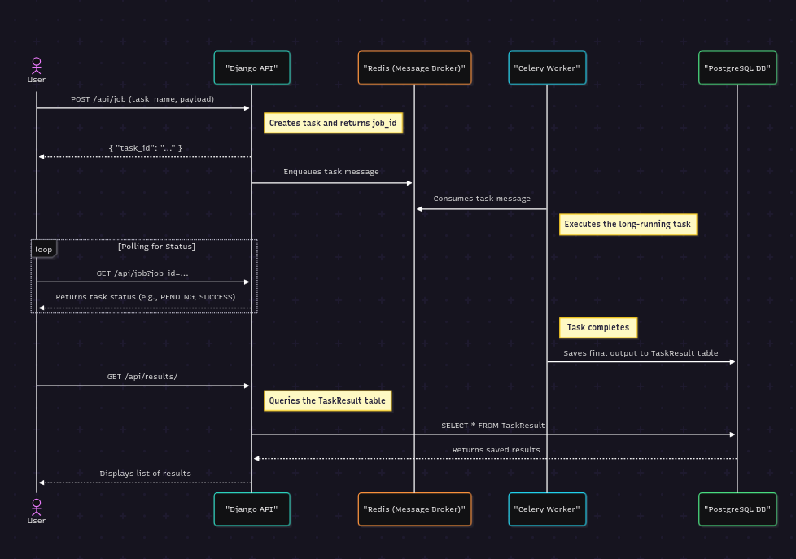

# Django Celery Asynchronous Task API

This project is a robust starter template for a Django-based API that offloads long-running tasks to Celery workers. It provides a simple, scalable architecture for handling asynchronous job processing, status polling, and result storage.

## System Architecture

The system is designed to decouple the API from the task execution, ensuring that the user experience is fast and responsive, even for jobs that take a long time to complete.



## Design Choices

-   **Django REST Framework (DRF):** Chosen for its powerful serialization, authentication, and request/response handling, making it easy to build clean, browsable APIs.
-   **Celery:** The industry standard for distributed task queues in Python. It allows for reliable, scalable execution of background tasks.
-   **Redis:** Used as both the message broker for Celery and the result backend. It is lightweight, fast, and well-suited for these roles.
-   **PostgreSQL:** A robust, open-source relational database used for storing the final, persistent results of completed tasks.
-   **Docker:** The entire application is containerized, ensuring a consistent and reproducible development and deployment environment.

## Role of AI

AI tools were used in this project primarily for bootstrapping and generating boilerplate code. This included:
-   Creating initial file structures for the Django project and API app.
-   Generating basic serializer and view classes.
-   Writing initial drafts of configuration files like `Dockerfile` and `docker-compose.yaml`.

This approach accelerates the initial development phase by automating repetitive setup tasks, allowing developers to focus on core business logic more quickly.

## Setup and Usage

1.  **Clone the repository:**
    ```bash
    git clone <repository-url>
    cd django-starter-api
    ```
## Environment Variables

Create a `.env` file in the root directory of the project and populate it with the following variables. These are essential for connecting to the database, Celery, and other services.

| Variable              | Description                                                                                                | Example                                                 |
| --------------------- | ---------------------------------------------------------------------------------------------------------- | ------------------------------------------------------- |
| `DATABASE_URL`        | The full connection string for the PostgreSQL database.                                                    | `postgres://user:devpass@db:5432/avomd`                 |
| `CELERY_BROKER_URL`   | The URL for the Redis message broker used by Celery to queue tasks.                                        | `redis://redis:6379/0`                                  |
| `CELERY_RESULT_BACKEND` | The URL for the Redis instance used by Celery to store task results.                                       | `redis://redis:6379/0`                                  |
| `POSTGRES_DB`         | The name of the PostgreSQL database.                                                                       | `django-ai-starter`                                     |
| `POSTGRES_USER`       | The username for connecting to the PostgreSQL database.                                                    | `user`                                                  |
| `POSTGRES_PASSWORD`   | The password for the PostgreSQL user.                                                                      | `devpass`                                               |
| `POSTGRES_HOST`       | The hostname or service name of the PostgreSQL container.                                                  | `db`                                                    |
| `POSTGRES_PORT`       | The port on which the PostgreSQL database is running.                                                      | `5432`                                                  |
| `SECRET_KEY`          | A secret key used for cryptographic signing in Django. Keep this value private.                            | `django-insecure-your-random-secret-key`                |
| `DEBUG`               | A boolean that toggles Django's debug mode. Should be `False` in production.                              | `True`                                                  |
| `OPENAI_API_KEY`      | Your API key for accessing the OpenAI API, used by some of the example tasks.                              | `sk-proj-xxxxxxxxxxxxxxxxxxxxxxxxxxxxxxxx`              |

3.  **Build and run the services:**
    ```bash
    docker-compose up --build -d
    ```
## Example Job Payload

To test the system, you can submit a `POST` request to the `/api/job/` endpoint. Here is an example payload that uses the `generate_checklist_from_guidelines` task to create a checklist from a set of guidelines.

You can find a sample `guidelines` document to use in the payload here: [Sample Guidelines Gist](https://gist.github.com/SpencerCooley/82b6de8724adedd830cc656af7c45a49)

```json
{
    "job_name": "api.tasks.generate_checklist_from_guidelines",
    "payload": {
        "guidelines": "..."
    }
}
```

## Checking Job Status

After submitting a job, you will receive a `task_id`. You can use this ID to poll the job status endpoint to check on the progress of your task.

Make a `GET` request to `/api/job/?job_id=<your_task_id>`.

The response will look like this, with the status updating as the task progresses:
```json
{
    "task_id": "your_task_id",
    "status": "SUCCESS",
    "result": { ... }
}
```

## Retrieving Job Results

Once a task that saves its output has successfully completed, you can retrieve its persistent result from the `/api/results/` endpoint. This endpoint can be filtered by `task_name`.

For example, to see all results for the `generate_checklist_from_guidelines` task, make a `GET` request to:
`/api/results/?task_name=api.tasks.generate_checklist_from_guidelines`

The response will be a list of all saved results for that task.

